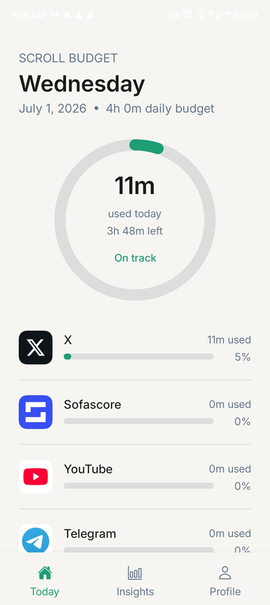
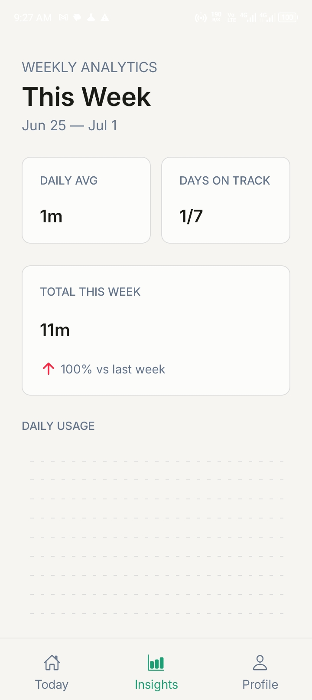
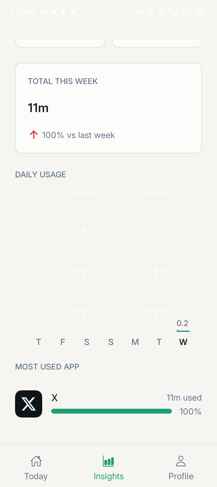
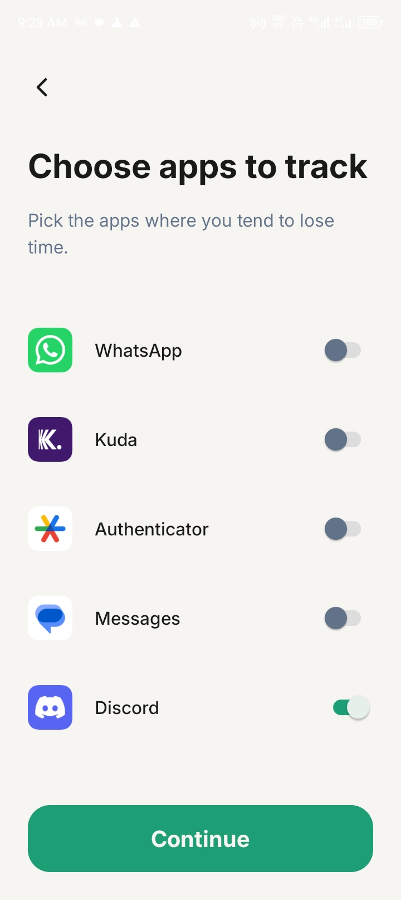
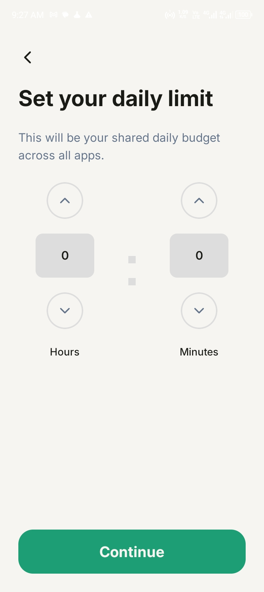
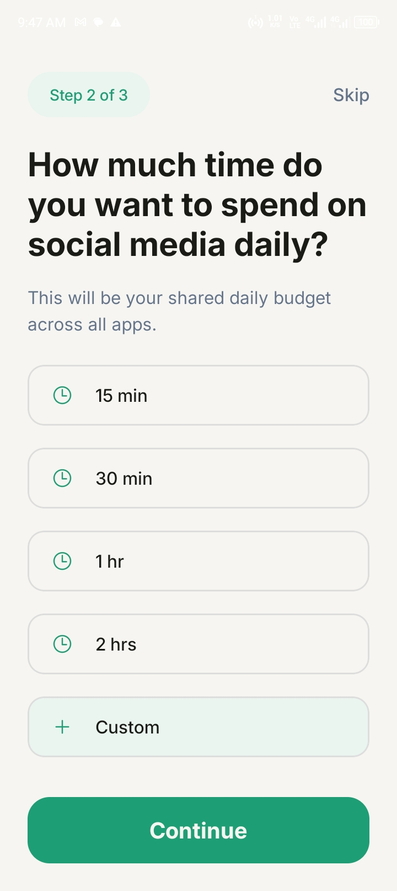

# Scroll Budget

**Take back your time, one app at a time.**

Scroll Budget is an Android app that helps you understand and control how much time you spend on the apps installed on your phone. Pick any app installed on your phone, set a daily time limit, and Scroll Budget tracks your usage and gives you clear, visual insight into your habits over time.

---

## Try It

📲 **[Download the latest build →](#)** <!-- replace with your APK/dev build link, or Play Store link once live -->

## Demo

<!--
Replace this with your actual demo once recorded. Two easy options:

1. GIF or MP4 committed to the repo (e.g. in a /media or /assets folder):
   

2. Drag-and-drop the video file into a new GitHub issue/comment (don't submit it) —
   GitHub uploads it and gives you a CDN link like:
   https://github.com/user/repo/assets/xxxxx/xxxxx.mp4
   Then embed it here as:
   https://github.com/user/repo/assets/xxxxx/xxxxx.mp4

Aim for 10-20 seconds: select an app to track → set a daily limit → view the dashboard updating with real usage data.
-->

_(Demo video coming soon — a 15-second walkthrough of selecting apps, setting a limit, and viewing live usage insights.)_

---

## Why Scroll Budget?

Most people don't realize how much time disappears into a handful of apps until they see the number. Scroll Budget isn't about guilt-tripping you off your phone. It's about making the invisible visible, so you can decide for yourself what "enough" looks like.

- **You choose what to track.** pick any app installed on your device.
- **Daily limits.** Set a combined daily budget across your tracked apps.
- **Clear insights.** See daily and weekly trends, not just a single scary number.
- **Private by design.** Scroll Budget only reads how long you use the apps you selected — never what you did inside them.

---

## Features

- 🎯 **Custom app selection** — track any installed app on your device
- ⏱ **Daily time budgets** — set a limit that works for you
- 📊 **Visual analytics** — animated progress rings and weekly trend charts
- 🔔 _(Coming soon)_ notifications and configurable limit actions
- 🔐 Secure sign-in via Google/Firebase Authentication

---

## How It Works

Scroll Budget is a full-stack mobile application:

- **Mobile app** (React Native / Expo) — the Android client you install, where you select apps, set limits, and view your dashboard and insights.
- **Backend API** (Node.js / Express / TypeScript) — securely stores your account and usage data, and powers the analytics behind your dashboard.
- **Database** (PostgreSQL via Prisma) — where your tracked apps, limits, and usage history live.

Usage data is read locally on your device using Android's usage-access APIs, then securely synced to your account so your history and insights are always available.

---

## Screenshots

### Dashboard

### Weekly Insights

### Select Apps

### Set Scroll Budget

---

## Tech Stack

| Layer              | Technology                                               |
| ------------------ | -------------------------------------------------------- |
| Mobile app         | React Native, Expo, Expo Router, TypeScript              |
| Auth               | Firebase Authentication                                  |
| Backend            | Node.js, Express, TypeScript                             |
| Database / ORM     | PostgreSQL, Prisma                                       |
| Hosting            | Render (backend), Prisma Postgres (database), EAS Builds |
| Charts & animation | react-native-gifted-charts, react-native-svg, Reanimated |

---

## Privacy & Terms

Scroll Budget only collects what's needed to run the app — no ads, no data sold to third parties.

- [Privacy Policy](https://jeremiahudom.github.io/scroll-budget-legal/privacy-policy)
- [Terms of Service](https://jeremiahudom.github.io/scroll-budget-legal/terms-of-service)

---

## Project Status

Scroll Budget is under active development. The current release focuses on a core, reliable tracking and insights experience. Planned additions include limit notifications, and configurable actions when a limit is reached.

---

## License

All Rights Reserved. This project's source code is not licensed for reuse, modification, or distribution without explicit permission.

---

## Contact

Have feedback, found a bug, or just want to say hi? Reach out at **ujsprojects@gmail.com**.
